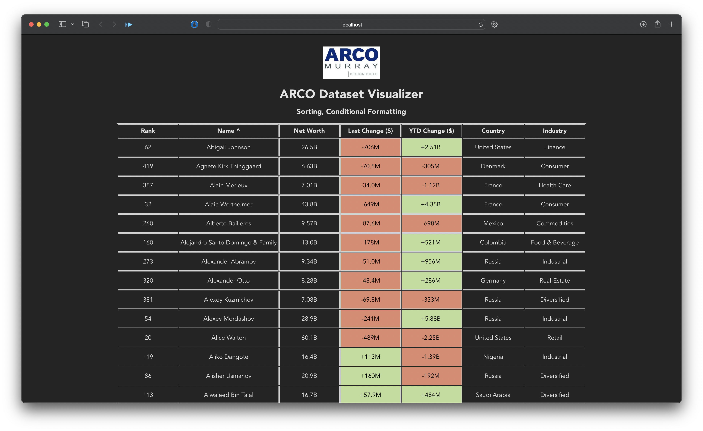

# arco-vdataset

A dataset visualizer for the take home technical assessment for ARCO/Murray's Innovation Team internship.

## Brief

Using TanStack Table and React, I created a simple, single page web-app that displays a local csv and offers conditional formatting and sorting. You are able to click on the majority of the columns to sort by them, with the exception of two which are not trivially sorted. My understanding of the assignment was that I should aim to create a useful, easy to understand collection of data. Although I initially wanted to write it in JSX due to being more comfortable with it, I saw that react-table had more extensive TypeScript documentation and decided to use that.

I budgeted:
- 30 minutes to configure the project with dependencies and project structure
- 60 minutes to learn the library, find a dataset, and display it simply
- 30 minutes to add as many features as I could and clean up the code

Ultimately I stuck to these guidelines for the most part. Some of the challenges I encountered were properly loading the csv and implementing column sorting. The main resource I used was the Tanstack-Table API and examples.